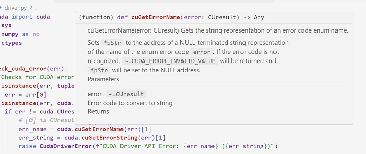

# cuda-python-stubs

> CUDA Python is the home for accessing NVIDIA's CUDA platform from Python.

This package provides type stubs (and docstrings) for [python cuda bindings](https://github.com/NVIDIA/cuda-python).
Enables features like auto-completion and hovering documentation when working with cuda-python in an IDE (like Visual Studio Code).

## Installation

```bash
pip install cuda-stubs
```

## Screenshot in Work


